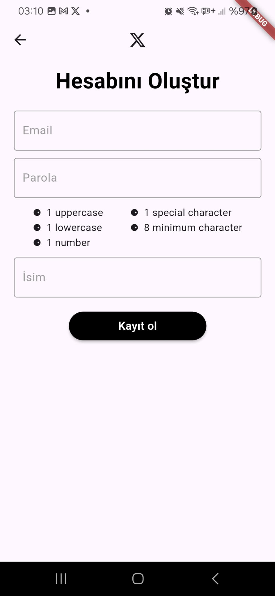
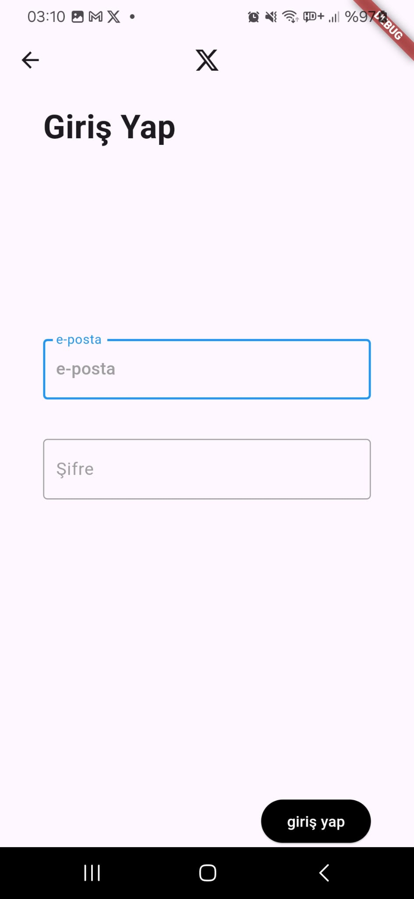
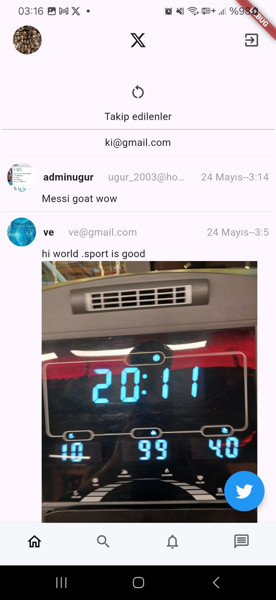
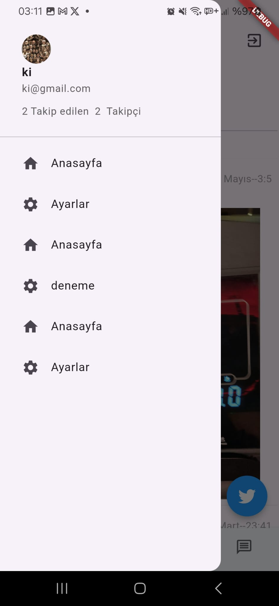
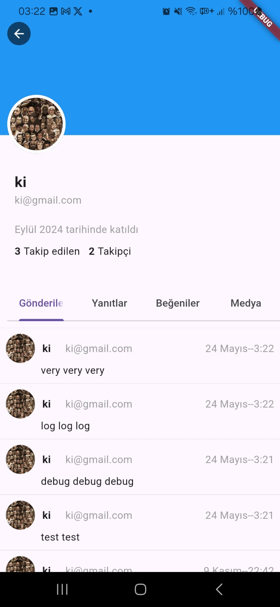
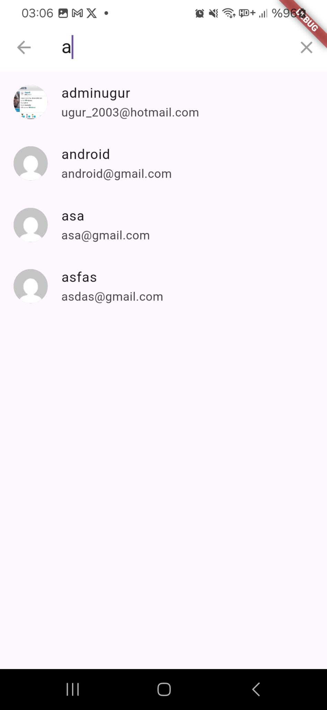
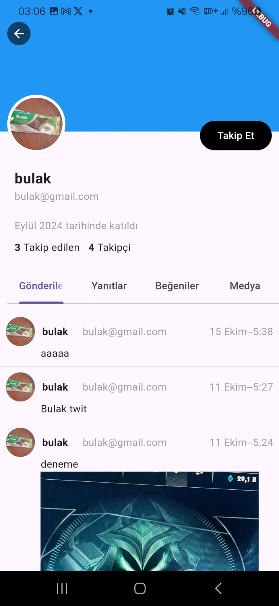
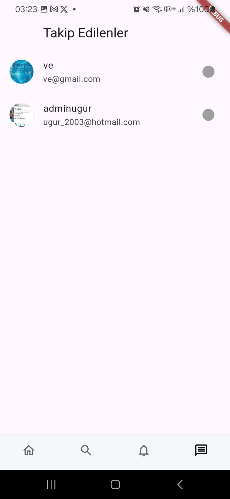
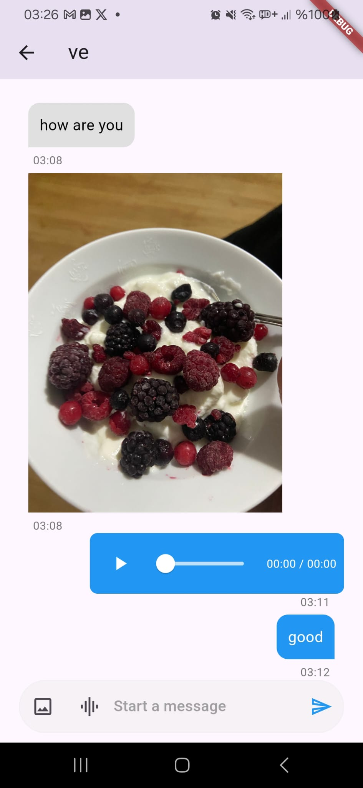

# 🐦 Flutter Twitter Clone

A full-featured social media app built with Flutter, replicating core Twitter functionalities. Users can post tweets, follow others, view real-time tweet feeds, and engage in one-on-one messaging within the app.

## 🚀 Features

- 🔐 **User Authentication:** Secure sign-up and login using Firebase Authentication.
- 📝 **Tweet Posting:** Share tweets with text and images
- 🔄 **Real-Time Tweet Feed:** Instantly updated tweet timeline using Firestore streams.
- 👤 **User Profiles:** View user-specific content including tweets, followers, and following lists.
- ➕ **Follow/Unfollow System:** Follow other users to personalize your timeline.
- 💬 **In-App Messaging:** Real-time one-on-one chat functionality.
- 🔔 **Notification System:** Optional alert system for  follows, and other interactions.
- 🔧 **Firebase Integration:** Cloud-based data management using Firebase Auth, Firestore, and Storage.

## 📱 Screenshots

  
  
  
  
  
  
  
  
  
  
  

